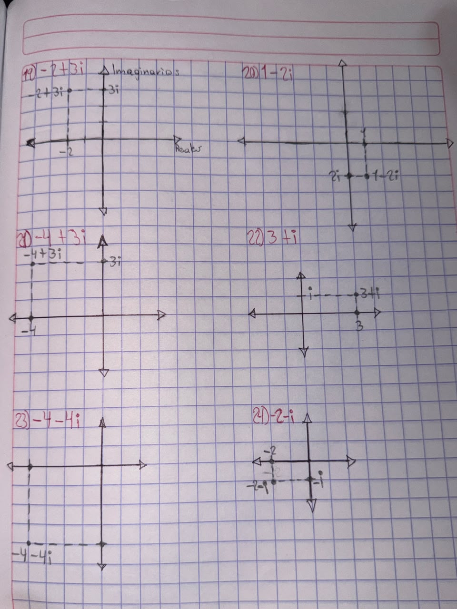

# **FUNDAMENTOS DE ÁLGEBRA**
**Ubica los siguientes números complejos en el plano**

**Resuelve las siguientes operaciones con los números complejos**

**25) ( -7 -4i) - ( 2 +i)**

=(-7-4i)-2-i

=-7-4i-2-i

(-7-2)+(-4i-i)

*=-9-5i*

**26) ( 2 - 4i) - ( 5 - 3i)**

= (2-4i)-5+3i

= 2-4i-5+3i

= (2-5)+(-4i+3i)

*= -3-i*

**27) (7 - 8i) - (3i) - 7**

= (7-8i)-3i-7

= 7-8i-3i-7

= (7-7)+(-8i-3i)

*= -11i*

**28) (1 + 5i) + (-8 - 5i) + 3**

= (1+5i)-8-5i+3

= 1+5i-8-5i+3

= (1-8+3)+(5i-5i)

*= -4*

**29) -8 - (3 - 5i) + (4 + 8i)**

= -8-3+5i+4+8i

= (-8-3+4)+(5i+8i)

*= -7+3i*

**30) (-4 + 2i) + (3i) + (-4 - 7i)**

= -4+2i+3i-4-7i

= (-4-4)+(2i+3i-7i)

*= -8-2i*

**31) (2i)(-4i)**

= -8i²

= -8(-1)

*= 8*

**32) (-2i)(5i) x 6**

= -10i² x 6

= -10(-1) x 6

= 10x6

*= 60*

**33) (-7i)(8 + 8i)(-2 - 8i)**

=  (-7i)-16-64i-16i-64i²

= (-7i)-16-64i-16i-64(-1)

= (-7i)-16-64i-16i+64

= (-7i)-16-80i+64

= (-7i)-80i+64-16

= (-7i)(-80i+48)

*= 560i-336*

**34) (-2 - 4i)(-1 - 6i)(7 - 6i)**

= -7+6i-42i+36i²

= -7+6i-42i-36

= -36i-43

= (-2-4i)(-36i-43)

= 72i+86+144i²+172i

= 72i+86+144(-1)+172i

= 72i+86-144+172i

= 72i+172i+86-144

*= 244i-58*

**35) (3i)(1 - 7i)(7 + 4i)**

= 7+4i-49i-28i²

= 7+4i-49i-28(-1)

= 7+4i-49i+28

= -45i+35

= (3i)(-45i+35)

= -135i²+105i

*= 135+105i*

**36) (-6i)(-5 + i)(6 - 2i)**

= -30+10i-6i-2i²

= -30+10i-6i-2(-1)

= -30+10i-6i+2

= 4i-28

= (-6i)(4i-28)

= -24i²+168i

= -24(-1)+168i

*= 168i+24*
